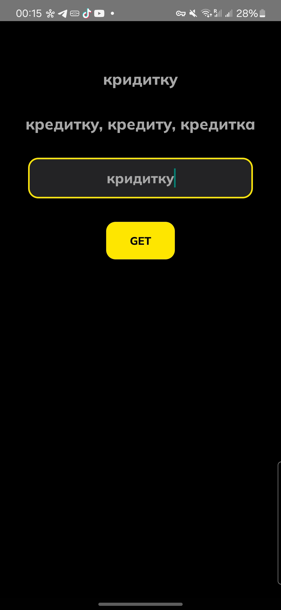
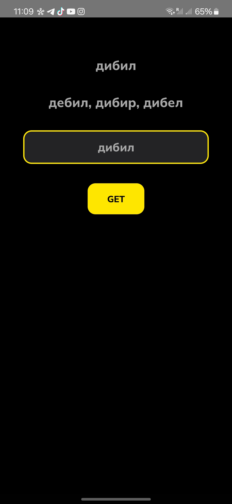
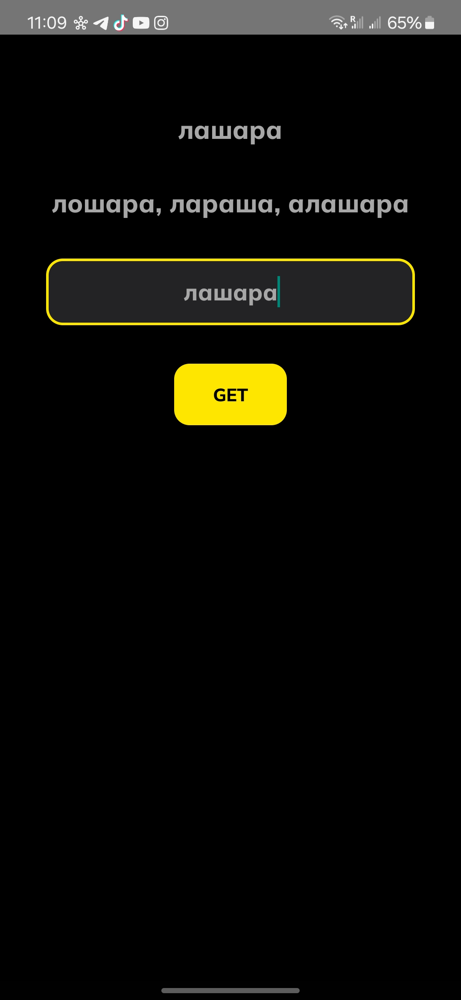
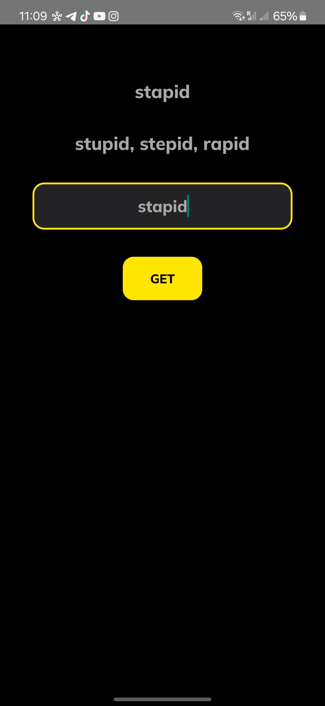
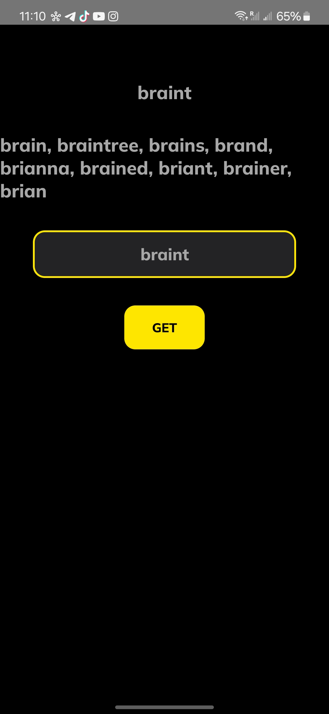
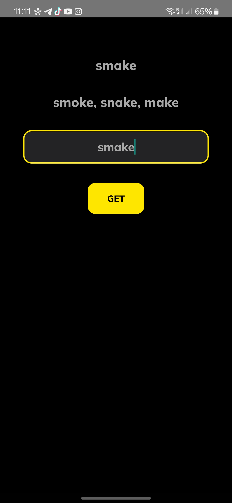

# SpellCheck App(ru)

SpellCheck App - это Android-приложение, которое использует API [Яндекс.Спеллер](https://yandex.ru/dev/speller/ "Яндекс.Спеллер") для проверки орфографии введенного слова. Приложение разработано с использованием паттерна MVVM (Model-View-ViewModel).

## Содержание

- [Технологии](#технологии)
- [Структура проекта](#структура-проекта)
- [Установка](#установка)
- [Использование](#использование)
- [Демонстрация](#демонстрация)
- [Конфигурация](#конфигурация)

## Технологии

- Kotlin
- AndroidX
- Retrofit
- LiveData
- ViewModel
- Coroutines

## Структура проекта

- **data**: содержит классы данных и интерфейсы для работы с API.
  - `CorrectedText.kt`: модель данных для результата проверки орфографии.
  - `CorrectedTextAPI.kt`: интерфейс для взаимодействия с API Яндекс.Спеллер.
- **viewmodel**: содержит ViewModel и Factory для MainActivity.
  - `MainViewModel.kt`: ViewModel для MainActivity.
  - `MainViewModelFactory.kt`: Factory для создания экземпляра MainViewModel.
- **MainActivity.kt**: главная активность приложения, где происходит взаимодействие с пользователем.

## Установка

1. Клонируйте репозиторий:
   ```bash
   https://github.com/IvanCRA/Spell-Check.git
   ```
2. Откройте проект в Android Studio.
3. Подождите пока Android Studio доустанавливает необходимые зависимости.
4. Синхронизируйте проект с Gradle(Sync Now).

## Использование

1. Запустите приложение на вашем устройстве или эмуляторе.
2. Введите слово для проверки орфографии.
3. Нажмите кнопку "GET".
4. Результат будет отображен на экране: исходное слово и исправленные варианты.

## Демонстрация








## Конфигурация
* API [Яндекс.Спеллер](https://yandex.ru/dev/speller/ "Яндекс.Спеллер"): приложение использует API [Яндекс.Спеллер](https://yandex.ru/dev/speller/ "Яндекс.Спеллер") для проверки орфографии.

# SpellCheck App(en)

SpellCheck App is an Android application that uses the [Yandex.Speller](https://yandex.ru/dev/speller/ "Yandex.Speller") API to check the spelling of the entered word. The app is developed using the MVVM (Model-View-ViewModel) pattern.

## Contents

- [Technology](#technology)
- [Project Structure](#project-structure)
- [Installation](#installation)
- [Usage](#usage)
- [Demonstration](#demonstration)
- [Configuration](#configuration)

## Technologies

- Kotlin
- AndroidX
- Retrofit
- LiveData
- ViewModel
- Coroutines

## Project structure

- **data**: contains data classes and interfaces for working with the API.
  - `CorrectedText.kt`: data model for spell check result.
  - `CorrectedTextAPI.kt`: interface for interacting with Yandex.Speller API.
- **viewmodel**: contains ViewModel and Factory for MainActivity.
  - `MainViewModel.kt`: ViewModel for MainActivity.
  - `MainViewModelFactory.kt`: Factory to create an instance of MainViewModel.
- **MainActivity.kt**: the main activity of the application where user interaction takes place.

## Installation

1. Clone the repository:
   ```bash
   git clone https://github.com/IvanCRA/Spell-Check.git
   ```
2. Open the project in Android Studio.
3. Wait for Android Studio to install the necessary dependencies.
4. Synchronize the project with Gradle(Sync Now).

## Usage.

1. Launch the application on your device or emulator.
2. Enter the word to be spell checked.
3. Press the “GET” button.
4. The result will be displayed on the screen: the original word and the corrected variants.

## Demonstration


## Configuration
* [Yandex.Speller](https://yandex.ru/dev/speller/ "Yandex.Speller") API: the application uses [Yandex.Speller](https://yandex.ru/dev/speller/ "Yandex.Speller") API to check spelling.